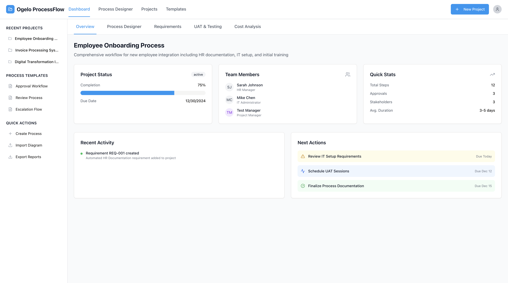

# Ogelo ProcessFlow

A comprehensive business process management platform that enables teams to design, track, and optimize workflows with advanced project management capabilities.

https://biztracker.ogelollm.app

 

  
    
## 🚀 Features

### Business Process Mapper
- **Visual Process Designer** with drag-and-drop elements (Start/End, Tasks, Approvals, Decisions)
- **BPMN-lite Support** with swimlanes for department-specific workflows
- **Mermaid.js Integration** for advanced diagram rendering with real-time preview
- **Template Library** with pre-built processes for common workflows
- **Export Capabilities** for process diagrams and definitions

### Project Tracker
- **Requirements Documentation** with complete CRUD operations and auto-generated codes
- **Cost Analysis** with budget vs actual tracking and visual indicators
- **Test Case Management** with structured UAT scenarios and step-by-step instructions
- **Team Member Management** with role assignments and visual identifiers
- **Activity Logging** for comprehensive project timeline tracking

### Collaboration & Export
- **Multi-format Export** supporting JSON, CSV, PDF, and Word formats
- **Template System** for rapid process deployment
- **Real-time Updates** with optimistic UI updates
- **Professional Artifacts** aligned with PMP/IIBA standards

## 🛠️ Technology Stack

### Frontend
- **React 18** with TypeScript for type-safe development
- **Wouter** for lightweight client-side routing
- **TanStack Query** for server state management and caching
- **Shadcn/ui** components built on Radix UI primitives
- **Tailwind CSS** for utility-first styling
- **Mermaid.js** for diagram rendering

### Backend
- **Node.js** with Express.js framework
- **PostgreSQL** with Neon Database (serverless)
- **Drizzle ORM** for type-safe database operations
- **TypeScript** throughout the entire stack

## 📦 Installation

### Prerequisites
- Node.js 18+ 
- PostgreSQL database 

### Quick Start 

1. **Fork or Clone this repo**
   - The database is already configured and ready to use
   - Install all dependencies

2. **Start the Application**
   ```bash
   npm run dev
   ```

   The application will be available at `http://localhost:5000`

### Local Development Setup

1. **Clone the repository**
   ```bash
   git clone <repository-url>
   cd ogelo-processflow
   ```

2. **Install dependencies**
   ```bash
   npm install
   ```

3. **Environment Configuration**
   Set up your environment variables:
   ```bash
   DATABASE_URL=your_postgresql_connection_string
   ```

4. **Database Setup**
   ```bash
   npm run db:push
   ```

5. **Start Development Server**
   ```bash
   npm run dev
   ```

   The application will be available at `http://localhost:5000`

## 🎯 Usage

### Creating a New Project

1. Navigate to the dashboard
2. Click "New Project" in the header
3. Fill in project details (name, description, due date)
4. Start adding team members, processes, and requirements

### Process Design

1. Go to the **Process** tab in your project
2. Click "+" to create a new process
3. Use the visual designer with drag-and-drop elements:
   - **Start/End** nodes for process boundaries
   - **Tasks** for activities and actions
   - **Approvals** for decision checkpoints
   - **Decisions** for branching logic
4. Add **swimlanes** to organize by departments
5. Edit Mermaid code directly for advanced customization
6. Save and export your process diagrams

### Requirements Management

1. Navigate to the **Requirements** tab
2. Add functional and non-functional requirements
3. Set priorities (High/Medium/Low) and track status
4. Export requirements in multiple formats (CSV, JSON, PDF, Word)

### Test Case Management

1. Go to the **Testing** tab
2. Create structured test cases with:
   - Test steps and expected results
   - Priority levels and status tracking
   - Tester assignments and issue reporting
3. Generate UAT reports and testing summaries

### Cost Analysis

1. Access the **Costs** tab
2. Add budget items by category
3. Track actual vs budgeted amounts
4. Monitor project financial health with visual indicators

## 📊 API Endpoints

### Projects
- `GET /api/projects` - List all projects
- `POST /api/projects` - Create new project
- `GET /api/projects/:id` - Get project details
- `PATCH /api/projects/:id` - Update project

### Processes
- `GET /api/projects/:id/processes` - List project processes
- `POST /api/projects/:id/processes` - Create new process
- `PATCH /api/processes/:id` - Update process

### Requirements
- `GET /api/projects/:id/requirements` - List requirements
- `POST /api/projects/:id/requirements` - Create requirement
- `PATCH /api/requirements/:id` - Update requirement

### Test Cases
- `GET /api/projects/:id/test-cases` - List test cases
- `POST /api/projects/:id/test-cases` - Create test case
- `PATCH /api/test-cases/:id` - Update test case

### Cost Items
- `GET /api/projects/:id/cost-items` - List cost items
- `POST /api/projects/:id/cost-items` - Create cost item
- `PATCH /api/cost-items/:id` - Update cost item

## 🏗️ Architecture

### Database Schema
- **Projects** - Main project containers with status and completion tracking
- **Team Members** - Project participants with roles and visual identifiers
- **Processes** - Business process definitions with Mermaid diagram support
- **Requirements** - Functional and non-functional requirements with priority tracking
- **Test Cases** - UAT test cases with execution tracking and results
- **Cost Items** - Budget tracking with planned vs actual cost analysis
- **Activities** - Project activity logging and timeline tracking

### Frontend Architecture
```
client/
├── src/
│   ├── components/     # Reusable UI components
│   │   ├── costs/      # Cost analysis components
│   │   ├── layout/     # Header, sidebar, navigation
│   │   ├── overview/   # Project overview dashboard
│   │   ├── process/    # Process designer and Mermaid components
│   │   ├── requirements/ # Requirements management
│   │   ├── testing/    # UAT and test case management
│   │   └── ui/         # Shadcn UI components
│   ├── hooks/          # Custom React hooks
│   ├── lib/            # Utilities and query client
│   └── pages/          # Route components
```

### Backend Architecture
```
server/
├── index.ts           # Express server setup
├── routes.ts          # API route definitions
├── storage.ts         # Database operations
├── db.ts             # Database connection
└── vite.ts           # Development server integration
```

## 📈 Performance

- **Sub-100ms API response times** for most operations
- **Real-time updates** via React Query with optimistic UI
- **Efficient caching** with intelligent cache invalidation
- **Serverless-ready** with Neon Database integration

## 🔧 Development

### Scripts
- `npm run dev` - Start development server
- `npm run build` - Build for production
- `npm run db:push` - Push schema changes to database
- `npm run check` - TypeScript type checking

### Code Style
- **TypeScript** for type safety across the entire stack
- **Modular architecture** with clear separation of concerns
- **Component-driven development** with reusable UI elements

### Current Status (July 2025)
- ✅ **Navigation & UI**: All header links and sidebar navigation functional
- ✅ **Project Management**: Complete CRUD operations for projects
- ✅ **Process Designer**: Visual designer with Mermaid integration fully operational
- ✅ **Requirements Management**: Complete requirements tracking with auto-generated codes
- ✅ **Test Case Management**: Structured UAT scenarios with execution tracking
- ✅ **Cost Analysis**: Budget tracking with visual indicators
- ✅ **Database**: PostgreSQL with optimized connection pooling
- ✅ **Template System**: Pre-built process templates for common workflows
- ✅ **Export Functionality**: Multiple format support for data export

### Recent Fixes
- Fixed PostgreSQL connection timeout issues
- Optimized database pool configuration
- Resolved process designer CRUD operations
- Enhanced Mermaid diagram rendering with scrollable containers

## 🤝 Contributing

1. Fork the repository
2. Create a feature branch (`git checkout -b feature/amazing-feature`)
3. Commit your changes (`git commit -m 'Add amazing feature'`)
4. Push to the branch (`git push origin feature/amazing-feature`)
5. Open a Pull Request

## 📄 License

This project is licensed under the MIT License - see the [LICENSE](LICENSE) file for details.

## 🆘 Support

For support and questions:
- Check the [Issues](../../issues) page for known problems
- Create a new issue for bug reports or feature requests
- Review the API documentation for integration details

## 🎉 Acknowledgments

- Built with modern web technologies for optimal performance
- Designed for professional project management workflows
- Aligned with PMP and IIBA industry standards
